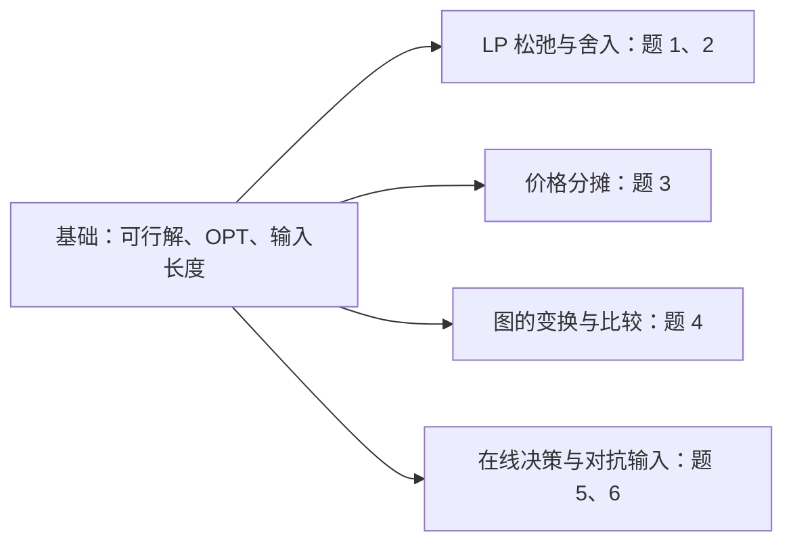
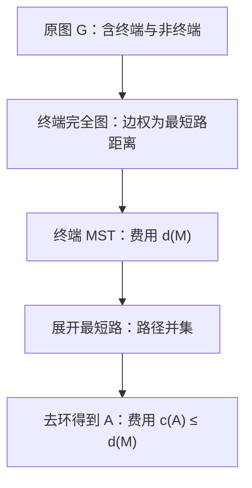
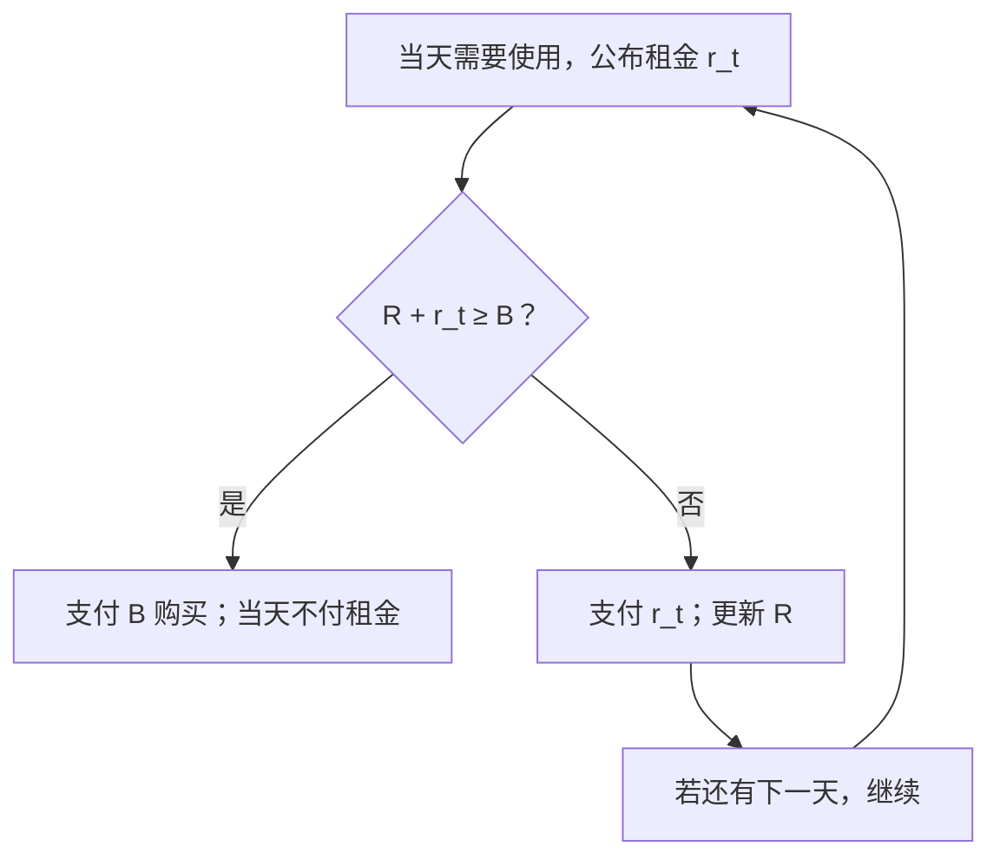
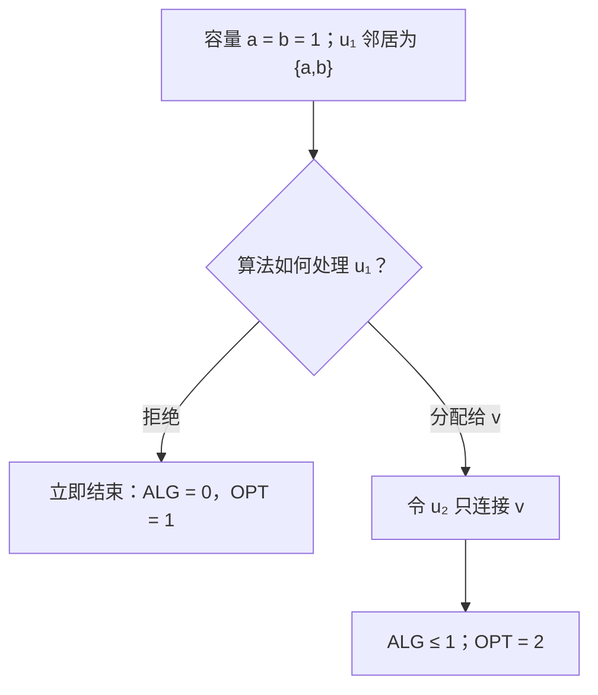

# Mermaid 图形源文件

本文件保存四幅关系与流程图的可编辑源定义。修改后运行构建脚本，重新生成对应的 `.mmd`、SVG 和 PDF 插图。

## 13-roadmap

```mermaid
flowchart LR
    accTitle: Assignment Learning Route
    accDescr: LP rounding supports questions one and two, charging supports question three, graph transformations support question four, and adversarial analysis supports questions five and six.
    basics["基础：可行解、OPT、输入长度"] --> lp["LP 松弛与舍入：题 1、2"]
    basics --> charge["价格分摊：题 3"]
    basics --> tree["图的变换与比较：题 4"]
    basics --> online["在线决策与对抗输入：题 5、6"]
```

## 14-steiner-pipeline

```mermaid
flowchart TB
    accTitle: Terminal MST Construction Steps
    accDescr: Start from the original graph, build the terminal distance graph, take an MST, expand shortest paths, then remove cycles.
    original["原图 G：含终端与非终端"] --> metric["终端完全图：边权为最短路距离"]
    metric --> mst["终端 MST：费用 d(M)"]
    mst --> union["展开最短路：路径并集"]
    union --> result["去环得到 A：费用 c(A) ≤ d(M)"]
```

## 15-rent-rule

```mermaid
flowchart TB
    accTitle: Rent Or Buy Threshold
    accDescr: At the start of each required day, observe the rent before deciding whether the total paid rent plus today's price reaches the purchase cost.
    reveal["当天需要使用，公布租金 r_t"] --> test{"R + r_t ≥ B？"}
    test -->|"是"| buy["支付 B 购买；当天不付租金"]
    test -->|"否"| rent["支付 r_t；更新 R"]
    rent --> next_day["若还有下一天，继续"]
    next_day --> reveal
```

## 16-matching-adversary

```mermaid
flowchart TB
    accTitle: Deterministic Matching Adversary
    accDescr: The first request can use either unit capacity vertex. If rejected, stop. If assigned to one vertex, the second request can only use that occupied vertex.
    first["容量 a = b = 1；u₁ 邻居为 {a,b}"] --> choice{"算法如何处理 u₁？"}
    choice -->|"拒绝"| stop["立即结束：ALG = 0，OPT = 1"]
    choice -->|"分配给 v"| second["令 u₂ 只连接 v"]
    second --> end_result["ALG ≤ 1；OPT = 2"]
```
